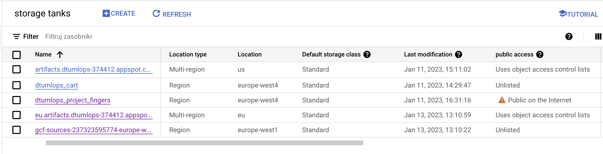

# Exam template for 02476 Machine Learning Operations

This is the report template for the exam. Please only remove the text formatted as with three dashes in front and behind
like:

```--- question 1 fill here ---```

where you instead should add your answers. Any other changes may have unwanted consequences when your report is auto
generated in the end of the course. For questions where you are asked to include images, start by adding the image to
the `figures` subfolder (please only use `.png`, `.jpg` or `.jpeg`) and then add the following code in your answer:

```markdown

```

In addition to this markdown file, we also provide the `report.py` script that provides two utility functions:

Running:

```bash
python report.py html
```

will generate an `.html` page of your report. After deadline for answering this template, we will autoscrape
everything in this `reports` folder and then use this utility to generate an `.html` page that will be your serve
as your final handin.

Running

```bash
python report.py check
```

will check your answers in this template against the constrains listed for each question e.g. is your answer too
short, too long, have you included an image when asked to.

For both functions to work it is important that you do not rename anything. The script have two dependencies that can
be installed with `pip install click markdown`.

## Overall project checklist

The checklist is *exhaustic* which means that it includes everything that you could possible do on the project in
relation the curricilum in this course. Therefore, we do not expect at all that you have checked of all boxes at the
end of the project.

### Week 1

* [x] Create a git repository
* [x] Make sure that all team members have write access to the github repository
* [x] Create a dedicated environment for you project to keep track of your packages
* [x] Create the initial file structure using cookiecutter
* [x] Fill out the `make_dataset.py` file such that it downloads whatever data you need and
* [x] Add a model file and a training script and get that running
* [x] Remember to fill out the `requirements.txt` file with whatever dependencies that you are using
* [x] Remember to comply with good coding practices (`pep8`) while doing the project
* [x] Do a bit of code typing and remember to document essential parts of your code
* [x] Setup version control for your data or part of your data
* [x] Construct one or multiple docker files for your code
* [x] Build the docker files locally and make sure they work as intended
* [ ] Write one or multiple configurations files for your experiments
* [ ] Used Hydra to load the configurations and manage your hyperparameters
* [x] When you have something that works somewhat, remember at some point to to some profiling and see if
      you can optimize your code
* [x] Use Weights & Biases to log training progress and other important metrics/artifacts in your code. Additionally,
      consider running a hyperparameter optimization sweep.
* [x] Use Pytorch-lightning (if applicable) to reduce the amount of boilerplate in your code

### Week 2

* [x] Write unit tests related to the data part of your code
* [x] Write unit tests related to model construction and or model training
* [x] Calculate the coverage.
* [x] Get some continuous integration running on the github repository
* [x] Create a data storage in GCP Bucket for you data and preferable link this with your data version control setup
* [x] Create a trigger workflow for automatically building your docker images
* [ ] Get your model training in GCP using either the Engine or Vertex AI
* [ ] Create a FastAPI application that can do inference using your model
* [ ] If applicable, consider deploying the model locally using torchserve
* [ ] Deploy your model in GCP using either Functions or Run as the backend

### Week 3

* [ ] Check how robust your model is towards data drifting
* [ ] Setup monitoring for the system telemetry of your deployed model
* [ ] Setup monitoring for the performance of your deployed model
* [ ] If applicable, play around with distributed data loading
* [ ] If applicable, play around with distributed model training
* [ ] Play around with quantization, compilation and pruning for you trained models to increase inference speed

### Additional

* [ ] Revisit your initial project description. Did the project turn out as you wanted?
* [ ] Make sure all group members have a understanding about all parts of the project
* [ ] Uploaded all your code to github

## Group information

### Question 1
> **Enter the group number you signed up on <learn.inside.dtu.dk>**
>
> Answer:

Group 30

### Question 2
> **Enter the study number for each member in the group**
>
> Example:
>
> *sXXXXXX, sXXXXXX, sXXXXXX*
>
> Answer:

s213617, s213027, s213612, s174032, s212588

### Question 3 (Antek)
> **What framework did you choose to work with and did it help you complete the project?**
>
> Answer length: 100-200 words.
>
> Example:
> *We used the third-party framework ... in our project. We used functionality ... and functionality ... from the*
> *package to do ... and ... in our project*.
>
> Answer:

--- We were working in the PyTorch ecosystem on a classification problem of images of hands showing a number of fingers. Instead of using pre-trained models or frameworks, we started off with designing and training a custom model. This model consisted of a convolutional backbone for feature extraction and a fully connected layer for classification. Eventually, we decided not to use any of the proposed open source frameworks as we were able to achieve 100% accuracy on the test set using our custom-designed architecture. We deliberately chose a fairly easy task to work with since we wanted to use our energy on learning the ML Ops methodology and frameworks. This approach allowed us to do so, as we didn't have to spend a significant amount of time on training and tuning the deep learning model. ---

## Coding environment

> In the following section we are interested in learning more about you local development environment.

### Question 4 (Ania)

> **Explain how you managed dependencies in your project? Explain the process a new team member would have to go**
> **through to get an exact copy of your environment.**
>
> Answer length: 100-200 words
>
> Example:
> *We used ... for managing our dependencies. The list of dependencies was auto-generated using ... . To get a*
> *complete copy of our development enviroment, one would have to run the following commands*
>
> Answer:

We used requirements.txt file to save and store all the dependancies used in the project. The final list of dependencies was auto-generated using the following command `pipreqs` executed at the root of the project directory. According to several online sources, this command is the best alternative as it saves only the packages used in the project, tackling the issues which occur if using `pip freeze`. After cloning the repository locally and being at its root, to get a complete copy of our development environment, one would have to run the following commands in the terminal:
* `pip3 install pipreqs`
* `conda create --name environemnt_name`
* `pip3 install -r requirements.txt`


### Question 5 (Helena)

> **We expect that you initialized your project using the cookiecutter template. Explain the overall structure of your**
> **code. Did you fill out every folder or only a subset?**
>
> Answer length: 100-200 words
>
> Example:
> *From the cookiecutter template we have filled out the ... , ... and ... folder. We have removed the ... folder*
> *because we did not use any ... in our project. We have added an ... folder that contains ... for running our*
> *experiments.*
> Answer:

--- question 5 fill here ---

### Question 6 (Ania)

> **Did you implement any rules for code quality and format? Additionally, explain with your own words why these**
> **concepts matters in larger projects.**
>
> Answer length: 50-100 words.
>
> Answer:

Even though there were no particular rules for quality and format implemented in the project, we explored two packages related to good coding practices.  **flake8** to check how pep8 compliant is our code and **isort** (the command `isort .`) to sort the import statements in all the relevant files. Besides that we commented the code in a comprehensive way. It is crucial to remember about documentation, styling and typing in larger projects to optimize the code quantity, organize it in aligned way between files and keep it accessible/understandable for every member and to enable a quick on-boarding of a new member.  

## Version control

> In the following section we are interested in how version control was used in your project during development to
> corporate and increase the quality of your code.

### Question 7 (David)

> **How many tests did you implement and what are they testing in your code?**
>
> Answer length: 50-100 words.
>
> Example:
> *In total we have implemented X tests. Primarily we are testing ... and ... as these the most critical parts of our*
> *application but also ... .*
>
> Answer:

We have implemented 2 tests in total. In the first test we are checking that the data gets correctly loaded, i.e. that the test and train data sets each have the expected number of data points that is 18000 for training and 3600 for testing and further that each image has the expected dimensions (1 x 128 x 128). In the second we test the model in the way that we check if the model produces for an input with shape (x , 1, 128, 128) an output of shape (x, 12) where 12 corresponds to the amount of defined classe.


### Question 8 (David)

> **What is the total code coverage (in percentage) of your code? If you code had an code coverage of 100% (or close**
> **to), would you still trust it to be error free? Explain you reasoning.**
>
> Answer length: 100-200 words.
>
> Example:
> *The total code coverage of code is X%, which includes all our source code. We are far from 100% coverage of our **
> *code and even if we were then...*
>
> Answer:

The total code coverage is 100% (see tests/coverage_report.txt). However, that doesn't mean that the code is free of errors. The implemented scripts test only specific aspects of the code. But since the whole code needs to be executed for testing those aspects the coverage is 100%. That shows, that the code passes the specific tests AND that it is possible to execute the code for loading the data and the model. Still, there could be errors at other points: The train and test images could be have errors that are not visible "from the outside". The model could have a architecture that makes it meaningsless or unable to actually train on the data. 
Hence the code coverage of 100% should be taken with a grain of salt. 

### Question 9 (Ania)

> **Did you workflow include using branches and pull requests? If yes, explain how. If not, explain how branches and**
> **pull request can help improve version control.**
>
> Answer length: 100-200 words.
>
> Example:
> *We made use of both branches and PRs in our project. In our group, each member had an branch that they worked on in*
> *addition to the main branch. To merge code we ...*
>
> Answer:

Since in the project GitHub served as our main repository, we tried to use github's features to facilitate the organization, and preventing from losing important information or implementing unwanted changes. Among others, everyone worked in their branch which they created locally. Once done with a chunk of work, they always pulled the new implementations to this branch. Afterwards, they issued a pull request explaining the changes made and in some cases asking also for double-checking if everything works for others. Then any other project member was responsible for accepting the merge with the `master` branch. When merging conflict appeared, we were carefully looking into built-in editor to adjust the final version of the file in question.

### Question 10 (Ania)

> **Did you use DVC for managing data in your project? If yes, then how did it improve your project to have version**
> **control of your data. If no, explain a case where it would be beneficial to have version control of your data.**
>
> Answer length: 100-200 words.
>
> Example:
> *We did make use of DVC in the following way: ... . In the end it helped us in ... for controlling ... part of our*
> *pipeline*
>
> Answer:

We did make use of DVC in the following way: 
* We installed all the necessary packages to run it.
* The data was downloaded locally by one of the project members and put in `data/` folder belogning to cookiecutter structure. 
* The remote storage was set to GCP bucket created specifically for this data. 
* The following commands were executed with relevant files mentioned, `dvc add -> git add -> git commit -> git tag -> dvc push -> git push`.
* Among others, the corresponding `.dvc/config` file was added to the repository to point to the storage, meanwhile the `data/` folder appeared in `.gitignore`. Also, the metafiles appeared in the remote storage.
* Finally, we checked if after clocning the repository, the user could simply run `dvc pull` and obtain the data locally.

This dat set up enabled us to store large files in GitHub which as a service prohibits those, issuing a warning when a file has already 50MB.

### Question 11 (Ania)

> **Discuss you continues integration setup. What kind of CI are you running (unittesting, linting, etc.)? Do you test**
> **multiple operating systems, python version etc. Do you make use of caching? Feel free to insert a link to one of**
> **your github actions workflow.**
>
> Answer length: 200-300 words.
>
> Example:
> *We have organized our CI into 3 separate files: one for doing ..., one for running ... testing and one for running*
> *... . In particular for our ..., we used ... .An example of a triggered workflow can be seen here: <weblink>*
>
> Answer:

We have organized our Continous Integration into 3 separate workflow files stored in `.github/workflows` folder: one for seting up the enviroment, ensuring that all dependacies are installed and data can be downloaded, second for running `flake8 .` and `isort .` commands on all the files to check whether the code is pep8 compliant and sorting imports in all coding files, respectively. Third workflow serves for running all the pytest unittests implemented to ensure that for example input data is in correct shape. In particular, the first and the third workflows were the most important for us because without them passing the app wouldn't execute, while the third one would be ideally passed when all the code have been adjusted to the pep8 requirements. Additionally, the caching was included in the workflow files to optimize the actions. 

An example of a triggered workflow reponsible for general tests (first one described) can be seen here: [General Tests](https://github.com/helenyaben/dtu_mlops_project/actions/runs/3933632932)

## Running code and tracking experiments

> In the following section we are interested in learning more about the experimental setup for running your code and
> especially the reproducibility of your experiments.

### Question 12 (David)

> **How did you configure experiments? Did you make use of config files? Explain with coding examples of how you would**
> **run a experiment.**
>
> Answer length: 50-100 words.
>
> Example:
> *We used a simple argparser, that worked in the following way: python my_script.py --lr 1e-3 --batch_size 25*
>
> Answer:

For a single training run we first used the predefined simple argparser, where we could define the learning rate as a command line argument: ```python my_script.py --lr 1e-3 --batch_size 25```.
When implementing logging with the W&B framework we used a config file ```config.yaml``` to specify learing rate, batch size and number of epochs. In the code, we loaded the parameters by the following codes:

```
open('./config.yaml') as file:
        config = yaml.load(file, Loader=yaml.FullLoader)
wandb.init(config=config)
# use values `wandb.config` instead from parser
lr  =  wandb.config.lr
bs = wandb.config.batch_size
epochs = wandb.config.epochs
```


### Question 13 (David)

> **Reproducibility of experiments are important. Related to the last question, how did you secure that no information**
> **is lost when running experiments and that your experiments are reproducible?**
>
> Answer length: 100-200 words.
>
> Example:
> *We made use of config files. Whenever an experiment is run the following happens: ... . To reproduce an experiment*
> *one would have to do ...*
>
> Answer:

For ensure reproducibility we used the W&B framework as described above. For each run we logged the configurations regarding learning rate, batch size and number of epochs. 
Further for each epoch we logged training accuracy, training loss and validation accuracy:
```
# Log epoch, loss and accuracy to wandb
wandb.log({
'epoch': e, 
'train_acc': train_accuracy,
'train_loss': train_loss,
'val_acc': val_accuracy,
})
```

This data is then saved in our common wandb team, as data for a run in a project. For reproducing an experiment we can look up the parameters, adapt the config file accordingly and run ```train_model.py```. 

To optimize the training we used W&B Sweep to automate hyperparameter search and explore the space of possible models. We create a sweep by 
- Defining a sweep coniguration, e.g. the range of batch sizes, epochs and learning rates in that we want to use for the training
- Initializing the sweep with the configurations: ```sweep=sweep_configuration, project='my-first-sweep')```
- Starting the sweep agent: ```wandb.agent(sweep_id, function=train)``` Here we define that is used for training. In the same manner as before we now can log the accuracy, loss and some example images that shows some predictions on the validation data set. 


### Question 14 (David)

> **Upload 1 to 3 screenshots that show the experiments that you have done in W&B (or another experiment tracking**
> **service of your choice). This may include loss graphs, logged images, hyperparameter sweeps etc. You can take**
> **inspiration from [this figure](figures/wandb.png). Explain what metrics you are tracking and why they are**
> **important.**
>
> Answer length: 200-300 words + 1 to 3 screenshots.
>
> Example:
> *As seen in the first image when have tracked ... and ... which both inform us about ... in our experiments.*
> *As seen in the second image we are also tracking ... and ...*
>
> Answer:


The first image shows the dashboard of one sweep. It provides an overview over the sweep and depicts firstly the runtime and configurations for each run in the sweep. In the upper right corner it shows the batch loss courve for each run. In the two charts below, the trainicng and validation accuracy is depicted for each run. Since we used selected the range 2-4 for the epochs to save time in the training process, only few datapoints are plottet. Still, it is visible that both training and validation accuracy improve for increasing epochs and the model doesn't overfit. The panel at the bottom shows some example images of the validation set with the according predicted and true labels. As we can see, all labels where predicted correctly in the examples. That indicates, that the model actually trained the desired properties.


The second image shows the detailed view of the training loss, logged for eatch batch of the training. 
It is vissible that the loss varied from batch to batch, yet all loss curves converge to 0. 
The speed of convergance varies from run to run, dependent on the configurations. 


This image shows the detailed view of the run comparison. It the exact parameters for each run, the number of steps and the total runtime as well as a summary statistics. Further, histograms for all model parameters are saved which alllows to compare the weights and biases for each run. 


### Question 15 (Helena)

> **Docker is an important tool for creating containerized applications. Explain how you used docker in your**
> **experiments? Include how you would run your docker images and include a link to one of your docker files.**
>
> Answer length: 100-200 words.
>
> Example:
> *For our project we developed several images: one for training, inference and deployment. For example to run the*
> *training docker image: `docker run trainer:latest lr=1e-3 batch_size=64`. Link to docker file: <weblink>*
>
> Answer:

--- question 15 fill here ---

### Question 16 (Oliver)

> **When running into bugs while trying to run your experiments, how did you perform debugging? Additionally, did you**
> **try to profile your code or do you think it is already perfect?**
>
> Answer length: 100-200 words.
>
> Example:
> *Debugging method was dependent on group member. Some just used ... and others used ... . We did a single profiling*
> *run of our main code at some point that showed ...*
>
> Answer:

--- question 16 fill here ---

## Working in the cloud

> In the following section we would like to know more about your experience when developing in the cloud.

### Question 17 (Helena)

> **List all the GCP services that you made use of in your project and shortly explain what each service does?**
>
> Answer length: 50-200 words.
>
> Example:
> *We used the following two services: Engine and Bucket. Engine is used for... and Bucket is used for...*
>
> Answer:

--- question 17 fill here ---

### Question 18 (Oliver)

> **The backbone of GCP is the Compute engine. Explained how you made use of this service and what type of VMs**
> **you used?**
>
> Answer length: 100-200 words.
>
> Example:
> *We used the compute engine to run our ... . We used instances with the following hardware: ... and we started the*
> *using a custom container: ...*
>
> Answer:

--- question 18 fill here ---

### Question 19 (Ania/Helena)

> **Insert 1-2 images of your GCP bucket, such that we can see what data you have stored in it.**
> **You can take inspiration from [this figure](figures/bucket.png).**
>
> Answer:
     
The *dtumlops_project_fingers* is the one where data is stored.


### Question 20 (Helena)

> **Upload one image of your GCP container registry, such that we can see the different images that you have stored.**
> **You can take inspiration from [this figure](figures/registry.png).**
>
> Answer:

--- question 20 fill here ---

### Question 21 (Helena)

> **Upload one image of your GCP cloud build history, so we can see the history of the images that have been build in**
> **your project. You can take inspiration from [this figure](figures/build.png).**
>
> Answer:

--- question 21 fill here ---

### Question 22 (Antek)

> **Did you manage to deploy your model, either in locally or cloud? If not, describe why. If yes, describe how and**
> **preferably how you invoke your deployed service?**
>
> Answer length: 100-200 words.
>
> Example:
> *For deployment we wrapped our model into application using ... . We first tried locally serving the model, which*
> *worked. Afterwards we deployed it in the cloud, using ... . To invoke the service an user would call*
> *`curl -X POST -F "file=@file.json"<weburl>`*
>
> Answer:

--- question 22 fill here ---

### Question 23 (Oliver)

> **Did you manage to implement monitoring of your deployed model? If yes, explain how it works. If not, explain how**
> **monitoring would help the longevity of your application.**
>
> Answer length: 100-200 words.
>
> Example:
> *We did not manage to implement monitoring. We would like to have monitoring implemented such that over time we could*
> *measure ... and ... that would inform us about this ... behaviour of our application.*
>
> Answer:

--- question 23 fill here ---

### Question 24 (everyone)

> **How many credits did you end up using during the project and what service was most expensive?**
>
> Answer length: 25-100 words.
>
> Example:
> *Group member s213027 used 3$, Group member 2 used ..., in total ... credits was spend during development. The service*
> *costing the most was ... due to ...*
>
> Answer:

--- question 24 fill here ---

## Overall discussion of project

> In the following section we would like you to think about the general structure of your project.
 
### Question 25 (everyone)

> **Include a figure that describes the overall architecture of your system and what services that you make use of.**
> **You can take inspiration from [this figure](figures/overview.png). Additionally in your own words, explain the**
> **overall steps in figure.**
>
> Answer length: 200-400 words
>
> Example:
>
> *The starting point of the diagram is our local setup, where we integrated ... and ... and ... into our code.*
> *Whenever we commit code and puch to github, it auto triggers ... and ... . From there the diagram shows ...*
>
> Answer:

--- question 25 fill here ---

### Question 26 (Antek/Oliver)

> **Discuss the overall struggles of the project. Where did you spend most time and what did you do to overcome these**
> **challenges?**
>
> Answer length: 200-400 words.
>
> Example:
> *The biggest challenges in the project was using ... tool to do ... . The reason for this was ...*
>
> Answer:

--- question 26 fill here ---

### Question 27 (everyone)

> **State the individual contributions of each team member. This is required information from DTU, because we need to**
> **make sure all members contributed actively to the project**
>
> Answer length: 50-200 words.
>
> Example:
> *Student sXXXXXX was in charge of developing of setting up the initial cookie cutter project and developing of the*
> *docker containers for training our applications.*
> *Student sXXXXXX was in charge of training our models in the cloud and deploying them afterwards.*
> *All members contributed to code by...*
>
> Answer:

--- question 27 fill here ---
